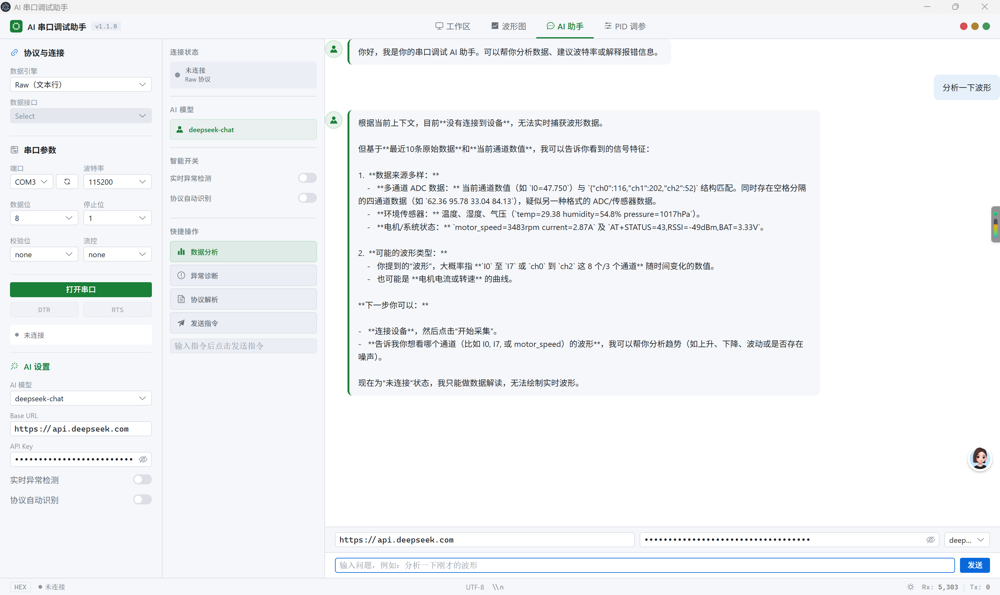

# AI 串口调试助手

> 一款面向嵌入式 / 硬件调试的桌面工具：把串口数据实时画成波形，用 AI 帮你读懂数据、辅助调参。
> 尤其适合参加**电赛、智能车、RC、RM** 等竞赛、需要频繁调 PID 的同学——把最耗时的试错环节压掉。



---

## 它能帮你做什么

- **实时波形**：串口数据自动绘制成多通道曲线，可缩放、平移、显隐通道、导出 CSV / JSON
- **数据表与录制回放**：结构化查看通道数值（I0–I7），一键录制数据流，回放时自动断开实时串口
- **AI 助手**：对接 OpenAI 兼容 API（默认 DeepSeek），做数据分析、异常诊断、协议解析，并自动携带串口上下文
- **确定性响应分析**：对阶跃响应**本地**计算上升时间、稳定时间、超调率、稳态误差、RMSE——不依赖 AI 也能跑
- **PID 辅助调参**：内置**策略注册表**（不同系统 / 控制结构预设验收指标），发阶跃 → 本地分析生成有界候选参数 → AI 解释 → 你手动二次确认再下发；可一键**导出嵌入式 `.c/.h` 控制器**（安全、可控）
- **离线模拟**：无需硬件，内置二阶欠阻尼阶跃响应，用来验证整套分析与调参链路

---

## 界面速览

应用主界面自上而下、自左而右分几个区域：

- **左侧边栏「协议与连接」**（SerialPanel）：选协议引擎、配串口参数、填 AI 设置、切 DTR / RTS
- **上部「实时波形」**（WorkspaceChart）：串口数据实时绘制成多通道曲线，**始终可见**；可拖动中间分隔条调整上下区域高度
- **下部分页签栏**：五个标签页，按需切换——
  - **数据流**：收发数据、自动发送、录制回放、控制响应模拟
  - **数据表**：结构化通道数值（I0–I7）
  - **数据分析**：本地确定性响应分析（上升 / 稳定时间、超调率、稳态误差、RMSE）
  - **AI 助手**：对话、快捷操作、异常检测、协议识别
  - **PID 调参**：阶跃采集 → 本地分析 → 辅助确认下发；仿真模式下支持一键自动调参（自动回退、达标即停）
- **底部状态栏**（StatusBar）：连接状态、Rx / Tx 计数、HEX 切换、主题切换

> 更多截图见 `参赛材料/`：`界面展示.png`、`数据展示.png`、`AI助手展示.png` 等。

---

## 系统要求

- Windows 10+ / macOS / Linux
- 若从源码运行：Node.js 18+、npm 9+
- AI 功能需要可访问的 OpenAI 兼容 API（默认 DeepSeek，需自备 Key）

---

## 快速开始

**方式一：开发预览（需 Node）**

```bash
cd ai-serial-assistant-app
npm install
npm run dev
```

Electron 窗口会自动打开，渲染进程由 Vite 提供热更新。

**方式二：构建安装包**

```bash
npm run dist
```

使用 electron-builder 生成当前平台的安装包。

> 国内环境已配置 `.npmrc` 使用 Electron 国内镜像，依赖安装更快。

---

## 使用指南

### 1. 连接串口

1. 左侧选择数据引擎（**Raw / JustFloat**）
2. 点「刷新」获取可用端口列表
3. 选端口、波特率、数据位、停止位、校验位、流控（默认 115200, 8N1）
4. 点「打开串口」建立连接
5. 连接后可点 DTR / RTS 按钮切换硬件控制信号

### 2. 收发数据

- **接收**：「数据流」标签实时显示，带时间戳与 Rx / Tx 方向标识
- **数据表**：切到「数据表」看结构化通道数值（I0–I7）
- **发送**：底部输入内容，选文本或 HEX 编码，回车或点发送
- **自动发送**：设间隔（ms）后定时循环发送，断连自动停止

### 3. 录制与回放

- 点「录制」开始记录串口数据流
- 点「回放」会**先自动关闭串口**，再按原始时间间隔重放
- 点「清空录制」清除录制数据

### 4. 实时波形

- 通道列表眼睛图标可显隐对应通道
- **Y 轴**：自动 / 手动（手动可设 Min / Max）
- **X 轴**：鼠标滚轮缩放，按住拖动平移
- **标准化绘图**：悬停提示与导出数据仍使用原始值
- **导出**：CSV / JSON 保存当前波形

### 5. AI 助手

切换到「AI 助手」标签页：

1. 左侧「AI 设置」填模型、Base URL、API Key（默认 DeepSeek；Key 仅留当前会话）
2. **快捷操作**：数据分析 / 异常诊断 / 协议解析（自动构造带串口上下文的 prompt）
3. 开启**实时异常检测**（3σ 统计 + stuck 检测）、**协议自动识别**（JSON / AT / CSV / Modbus HEX / ASCII）
4. 自由对话会自动携带最近数据与通道数值作为上下文

支持模型：`gpt-4o-mini`、`gpt-4o`、`deepseek-chat`、`qwen-turbo`

### 6. PID 辅助调参

切换到「PID 调参」标签页：

1. 先在「策略注册表」选控制策略（如空载电机、平衡车等，内置验收指标：超调 ≤ X%、稳定带 ±Y%）；选测试来源（**仿真** 纯软件验证不下发硬件 / **真实串口**）
2. 配阶跃指令、幅值、采集时长、反馈通道，点击发送
3. **本地确定性分析**算指标并生成 Kp / Ki / Kd 候选（受 Kp 0~20、Ki / Kd 0~10 边界约束）
4. AI **只解释**原因与风险，不改参数
5. 确认设备处于安全工况、记好原参数后，在二次确认框中手动确认下发
6. 需要嵌入到单片机时，点「导出 .c / .h」一键生成控制器代码文件
7. **自动调参（仅仿真模式）**：点「开始自动调参」，工具会连续跑多轮实验——每轮自动算指标、仅在稳定时记录最佳、检测劣化自动回退、达标或无改善时提前停止。引擎可选「AI + 本地规则混合」（有 API Key 时 AI 给参 + 安全护栏，AI 失败自动切规则）或「本地规则」（完全离线）。真实硬件仍走第 5 步的人工确认，不会自动下发。

### 7. 离线体验（无需硬件）

在「数据流」标签页点「控制响应模拟」生成 50 ms 采样的二阶欠阻尼阶跃响应（I0 目标、I1 反馈、I2 控制量、I3 误差）。跑数秒后，切到「数据分析」标签页查看响应指标，或在「PID 调参」里走完整调参链路——全程无需任何硬件。仿真模式下还能一键「自动调参」体验闭环（离线可用，无需 API Key）。

---

## 常见问题

| 问题 | 解决 |
|------|------|
| 串口打不开 | 检查是否被其他程序占用；必要时以管理员权限运行 |
| 想要浅色 / 深色 | 状态栏主题按钮切换，localStorage 记忆，**默认浅色** |
| AI 没反应 | 检查 Base URL / Key / 模型；Key 仅当前会话有效，重启需重填 |
| 波形不显示 | 确认协议引擎与设备输出格式匹配（Raw：行内数字；JustFloat：二进制浮点帧） |

---

## 给开发者

代码架构、目录结构、IPC、协议解析、开发命令等请见 **[`ai-serial-assistant-app/README.md`](ai-serial-assistant-app/README.md)**。
