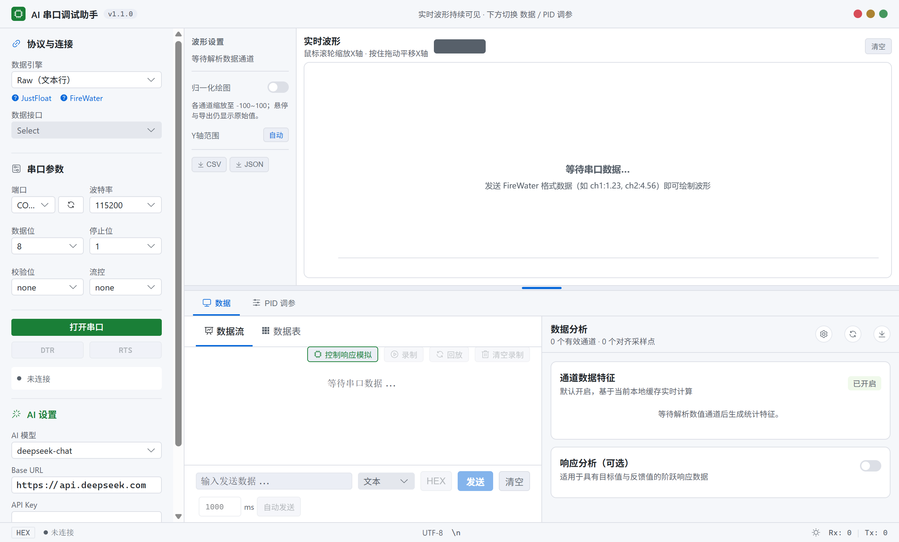
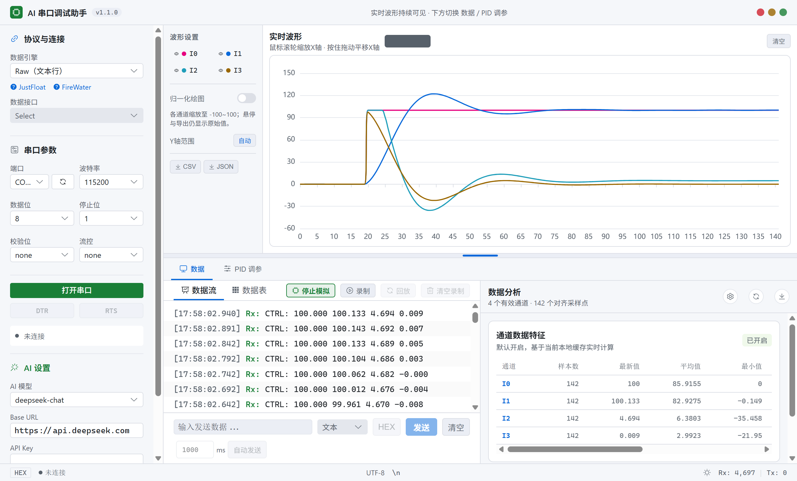
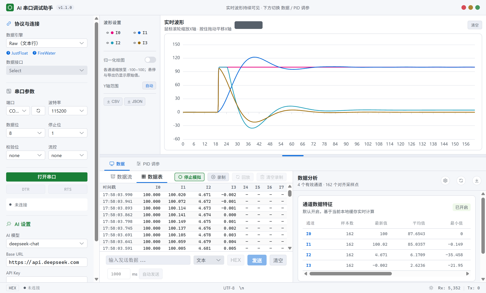
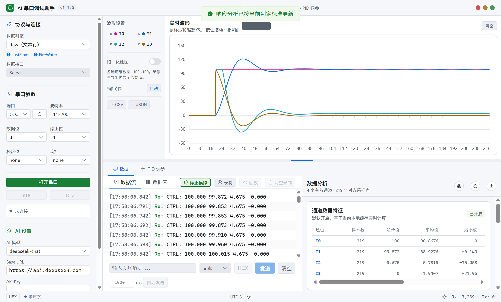
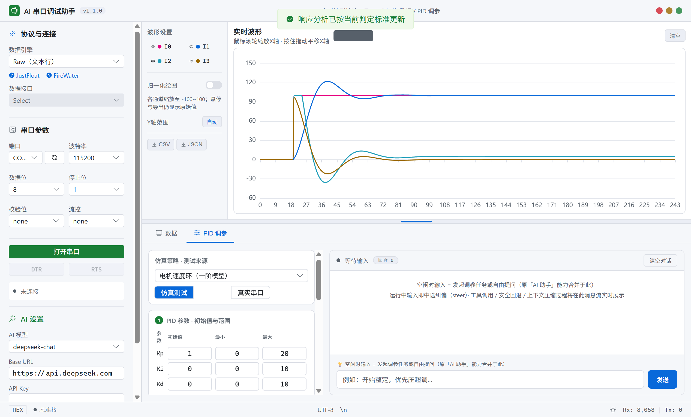
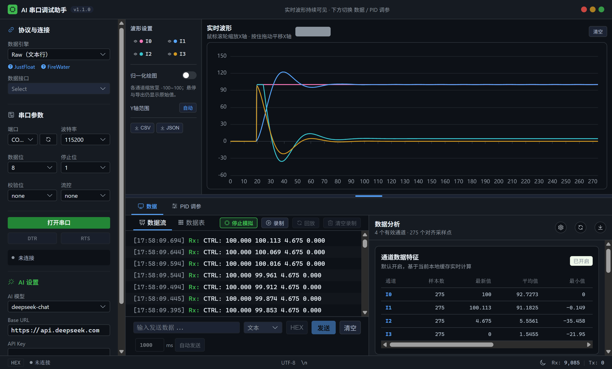

# AI 串口调试助手 · 使用说明书

> 版本：v1.1.0　|　适用平台：Windows 10+（64 位）
> 一款面向嵌入式 / 硬件调试的桌面工具：把串口数据实时画成波形，用 AI 帮你读懂数据、辅助调参。
> 特别适合参加**电赛、智能车、RC、RM** 等竞赛、需要频繁调 PID 的同学。

---

## 目录

1. [产品简介](#1-产品简介)
2. [安装软件](#2-安装软件)
3. [界面总览](#3-界面总览)
4. [连接串口](#4-连接串口)
5. [实时波形](#5-实时波形)
6. [数据流与数据表](#6-数据流与数据表)
7. [数据分析](#7-数据分析)
8. [AI 能力配置](#8-ai-能力配置)
9. [PID 调参智能体](#9-pid-调参智能体)
10. [离线体验（无需硬件）](#10-离线体验无需硬件)
11. [主题切换](#11-主题切换)
12. [常见问题](#12-常见问题)

---

## 1. 产品简介

AI 串口调试助手是传统串口调试工具的「AI 增强版」，核心能力：

| 能力 | 说明 |
|------|------|
| **实时波形** | 串口数据自动绘制成多通道曲线（I0–I7），支持缩放、平移、显隐通道、导出 CSV / JSON |
| **数据流 / 数据表** | 实时收发日志（带毫秒时间戳）、结构化通道数值、自动发送、录制回放 |
| **数据分析** | 对阶跃响应**本地**计算上升时间、稳定时间、超调率、稳态误差、RMSE——不依赖 AI 也能跑 |
| **AI 能力** | 对接 OpenAI 兼容 API（默认 DeepSeek），数据分析一键「AI 解释」，PID 调参由对话式智能体自主驱动 |
| **PID 调参智能体** | 自动「查数据 → 改参数 → 设目标 → 看结果 → 再决策」闭环，参数受安全护栏三重校验、越限自动回退 |
| **离线模拟** | 无需硬件即可体验完整链路 |

---

## 2. 安装软件

1. 双击安装包 **`AI 串口调试助手 Setup 1.1.0.exe`**。
2. 在安装向导中点击「下一步」，可自定义安装目录（默认安装在 `C:\Users\<用户名>\AppData\Local\Programs\AI 串口调试助手`）。
3. 安装完成后，桌面与开始菜单会生成 **「AI 串口调试助手」** 快捷方式，双击即可启动。

> 说明：Windows SmartScreen 可能提示「已保护你的电脑」——点击「更多信息」→「仍要运行」即可（软件未购买代码签名证书所致）。

---

## 3. 界面总览



应用主界面自上而下、自左而右分为几个区域：

| 区域 | 说明 |
|------|------|
| **顶部标题栏** | 应用名称与版本号（v1.1.0） |
| **左侧边栏** | 「协议与连接」：选协议引擎、配串口参数、连接控制（DTR/RTS）、AI 设置 |
| **上部实时波形** | 串口数据实时绘制成多通道曲线，**始终可见**；可上下拖动中间分隔条调整高度 |
| **下部分页签** | 两个标签页：**数据**（左：数据流/数据表；右：数据分析）、**PID 调参** |
| **底部状态栏** | 连接状态、HEX 切换、Rx / Tx 计数、主题切换 |

---

## 4. 连接串口

1. 在左侧「协议与连接」中选择**数据引擎**：
   - **Raw（文本行）**：设备以文本行输出数字，如 `12.5 3.2 8.0`
   - **JustFloat（浮点帧）**：二进制四字节浮点帧（帧尾 `00 00 80 7F`）
   - **FireWater（标签:值）**：冒号前为标签、冒号后为数值，如 `speed,pwm,error: 1200,35.5,-2.1`
2. 在「串口参数」区域点「刷新」获取可用端口列表。
3. 选择**端口**，并按设备配置**波特率 / 数据位 / 停止位 / 校验位 / 流控**（常见默认 115200、8N1）。
4. 点击「**打开串口**」建立连接，左侧状态点变绿并显示 `已连接 COMx`。
5. 连接后可点击 **DTR / RTS** 按钮切换硬件控制信号（如 Arduino 复位、RS485 收发切换）。

> 提示：若列表中没有你的设备，先检查设备是否被其他软件占用、驱动是否安装，或点击「刷新」重试。

---

## 5. 实时波形



- 串口收到的每行数据会自动拆分为数值，绘制成 I0–I7 多通道曲线。
- **显隐通道**：点击通道列表的眼睛图标切换显示。
- **Y 轴**：自动 / 手动（手动可设 Min / Max）。
- **X 轴**：鼠标滚轮缩放，按住拖动平移。
- **导出**：右上角按钮可把当前波形导出为 CSV / JSON。
- 悬停曲线可查看每个采样点各通道的**原始值**（绘图时可按通道归一化，但数据本身保真）。

---

## 6. 数据流与数据表

在「数据」标签页左侧有两个子页签：

**数据流**：实时收发日志，带毫秒时间戳与方向标识（Rx 收 / Tx 发 / Sy 系统 / Er 错误）。底部可：
- 输入内容并选择**文本 / HEX** 编码后「发送」（回车亦可）
- 设置间隔（ms）后「**自动发送**」定时循环，断连自动停止
- 「**录制**」记录数据流 →「**回放**」（回放前会自动关闭串口，避免实时与历史数据混合）
- 「**控制响应模拟**」无需硬件生成阶跃响应数据（见第 10 节）

**数据表**：结构化展示每行解析出的通道数值（I0–I7）。



---

## 7. 数据分析

在「数据」标签页右侧是「数据分析」面板，分两部分：

1. **通道数据特征（EDA）**：默认开启，实时统计各通道的最新值、平均值、最小/最大、绝对峰值、均方根、标准差。
2. **响应分析（可选）**：适用于带目标值与反馈值的阶跃响应数据。打开开关后：
   - 选择**目标 / 反馈**通道（默认 I0 目标、I1 反馈）与采样间隔
   - 点击「**生成响应分析**」，本地算出**上升时间 / 稳定时间 / 超调率 / 稳态误差 / RMSE / 稳态波动**，并给出响应状态（良好 / 需关注 / 高风险）与风险列表
   - 可点「AI 解释」让模型给出「为什么超调、往哪调」的说明（需 API Key；无 Key 时确定性指标照常可用）
   - 可一键「导出报告」为自包含 HTML，便于贴进竞赛设计文档



> 右侧齿轮可调整判定标准：稳定带宽（默认 ±5%）、超调警戒线（默认 20%）、稳态波动警戒线（默认 10%）、稳态误差阈值（默认 5%）、最少采样点（默认 8）。

---

## 8. AI 能力配置

在左侧边栏「AI 设置」区域统一配置：

- **AI 模型**：默认 `deepseek-chat`，支持 `gpt-4o-mini`、`gpt-4o`、`deepseek-chat`、`qwen-turbo` 等（可直接输入自定义模型名）
- **Base URL**：默认 `https://api.deepseek.com`，可改为任意 OpenAI 兼容接口地址
- **API Key**：填入你的密钥。**仅保存在当前会话**，重启需重新填写

AI 能力用在两处：
1. **数据分析 → AI 解释**：把响应指标与通道特征打包成结构化上下文发给模型
2. **PID 调参智能体**：对话式调参由 AI 驱动（见下一节），空闲时在右侧输入框提问即可自由问答（原「AI 助手」对话能力已合并于此）

---

## 9. PID 调参智能体

切换到「PID 调参」标签页，这是整套软件的核心亮点。



### 9.1 左栏配置（开始调参前完成）

| 配置项 | 说明 |
|--------|------|
| **仿真策略** | 电机速度环（一阶模型）/ 位置—速度串级 PID / 不稳定二阶系统（倒立摆） |
| **测试来源** | **仿真测试**（纯软件，不下发硬件）/ **真实串口**（需先连接设备） |
| **① PID 参数** | 每项填初始值 / 最小 / 最大（串级策略自动展开位置环 + 速度环 6 项；取值范围即护栏第一重约束） |
| **② 信号安全范围** | 控制值 / 反馈值 / 目标值各自的 min ~ max（越限告警） |
| **③ 前馈项** | 点「＋ 添加前馈项」，从模板（线性 / 二次 / sin / cos / 重力补偿 / 常数偏置 / 目标一阶导等）选择并填系数范围 |
| **④ 控制场景提示词**（必填） | 描述被控对象、调参目标与特殊约束，如「直流电机速度环，额定转速 3000rpm，带 5:1 减速器，允许 10% 超调」 |

### 9.2 开始调参

1. 在右侧输入框输入任务描述（如「开始整定，优先压超调」），点「**开始调参**」或回车。
2. 智能体开始自主闭环：**查通道统计 → 改 PID / 前馈 → 设目标做阶跃 → 看响应 → 再决策**。
3. 右侧消息流实时展示：
   - 🤔 助手思考（打字机流式输出）
   - 🔧 工具调用单行（如 `get_channel_stats`、`set_pid_params`、`set_target`）
   - ⚠ 安全机制自动回退（红色警示块）
   - 📦 上下文压缩提示条
4. 运行中在输入框输入文字可**中途纠偏**（steer）；会话结束后输入即**追加新任务**（followUp）。

### 9.3 安全机制

- 参数经**三重校验**：用户配置范围 → 系统上限（Kp≤20、Ki/Kd≤10）→ 单步增幅限制
- 每次阶跃采集后自动做安全检测，超调 / 振荡越限时**自动回退到最佳稳定参数**并以红色警示块醒目提示
- 仿真模式下可放心大胆体验完整闭环；真实串口模式点「设目标」会向设备下发 `SET_POINT` 指令并异步采集响应

> 建议：真实硬件调参前，务必先在「仿真测试」模式跑通流程，再切换到真实串口。

---

## 10. 离线体验（无需硬件）

1. 在「数据流」子页签点击「**控制响应模拟**」，自动生成 50 ms 采样的二阶欠阻尼阶跃响应（I0 目标、I1 反馈、I2 控制量、I3 误差），波形立即出现在上部区域。
2. 跑数秒后：
   - 切到「数据分析」开启响应分析，查看完整指标；
   - 或切到「PID 调参」，以**仿真测试**模式走完整调参链路。

全程无需任何硬件、无需 API Key，即可验证整套分析、调参闭环。

---

## 11. 主题切换

- 点击底部状态栏最右侧的 ☀ / 🌙 按钮，在**亮色 / 暗色**主题间切换。
- 选择会被记住（localStorage），下次启动自动应用，**默认亮色**。



---

## 12. 常见问题

| 问题 | 解决 |
|------|------|
| 串口打不开 | 检查是否被其他程序占用；必要时以管理员权限运行 |
| 列表里没有我的设备 | 检查驱动与连接线，点击「刷新」重试 |
| AI 没反应 | 检查 Base URL / Key / 模型；Key 仅当前会话有效，重启需重填 |
| 波形不显示 | 确认协议引擎与设备输出格式匹配（Raw：行内数字；JustFloat：二进制浮点帧） |
| 数据分析提示「样本不足」 | 先采集足够数据（默认最少 8 个采样点），再生成分析 |
| PID 调参「开始调参」没反应 | 检查「控制场景提示词」是否填写（必填项） |

---

## 附：开发与构建

- 技术栈：Electron + Vue 3 + Element Plus + ECharts + serialport
- 源码开发：
  ```bash
  cd ai-serial-assistant-app
  npm install
  npm run dev      # 开发预览（自动打开 DevTools）
  npm run dist     # 构建并打包为安装包（输出到 release/）
  ```
- 环境要求：Node.js 18+、npm 9+

> 更详细的功能说明见仓库根目录 `README.md`，开发者文档见 `ai-serial-assistant-app/README.md`。
